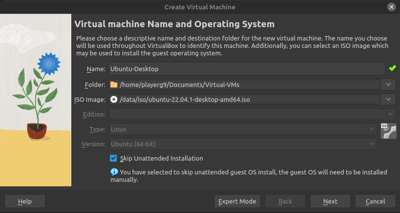
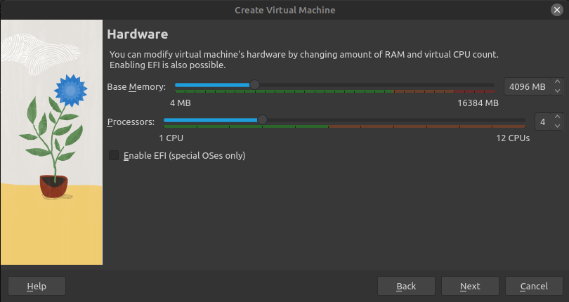
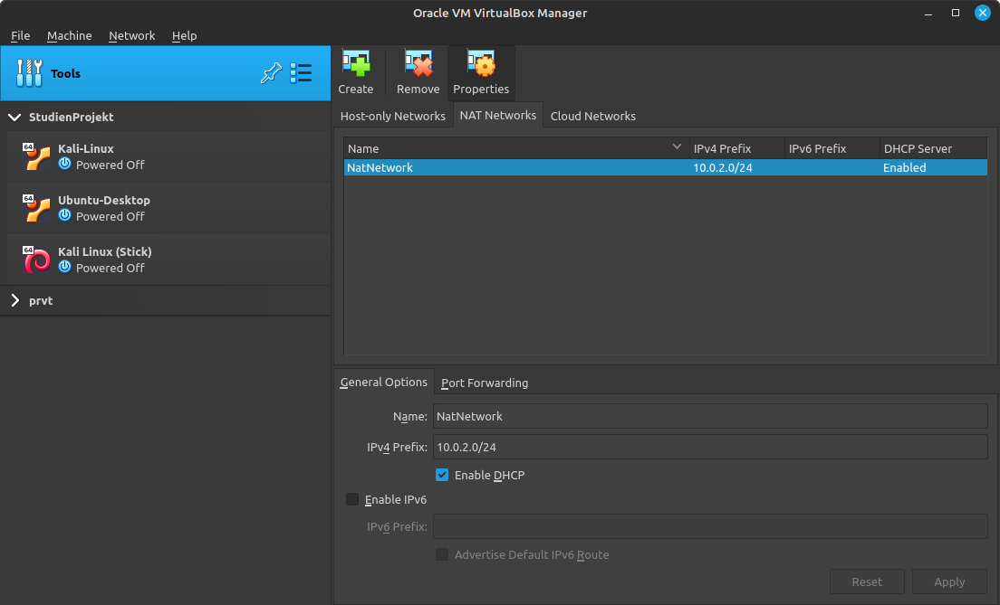

# How to setup a virtual machine
{: .no_toc }

* TOC
{:toc}

## Installation of VirtualBox

[VBox-Download](https://www.virtualbox.org/wiki/Downloads){:target="_blank"}

{: .important }
> you need the version 7.X+
>
> Since that version there is an option during the creation of a Virtual-Machine to create it based directly of an ISO-Image

## Setup of Ubuntu and Kali VM's

> There is a pretty good [ubuntu tutorial](https://ubuntu.com/tutorials/how-to-run-ubuntu-desktop-on-a-virtual-machine-using-virtualbox#1-overview){:target="_blank"} on how to do it

ISO-Image should be the one you downloaded from [ubuntu.com](https://ubuntu.com/download/desktop){:target="_blank"} and [kali.org](https://www.kali.org/get-kali/#kali-platforms){:target="_blank"}

(note ubuntu: it doesn't matter if you are using the LTS version or not)

{: .important }
> skip unattended installation

recommended base-memory: 2048MB (better 4096MB)

recommended processors: 2 (better 4)

minimum size for the virtual hard is around 10GB-15GB

## Setup of the Network

